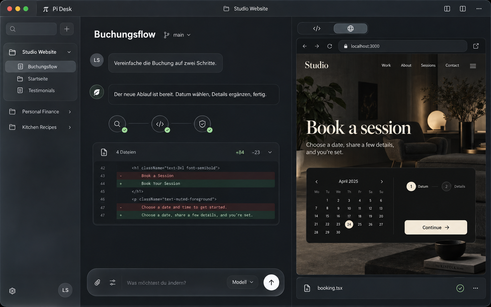

# Quiet Studio — Dark refinement

Bildentwurf mit dem eingebauten Imagegen-Werkzeug, basierend auf 01-quiet-studio.png. Beispieldaten, keine implementierte App.

## Prompt

Use case: ui-mockup. Edit the supplied Quiet Studio desktop app concept into an exquisitely refined DARK macOS-inspired version. This is a substantial refinement of the same app and three-region information architecture, not just color inversion. One landscape 16:10 high-resolution front-on screenshot filling frame, no surrounding laptop or desktop. Name Pi Desk. User specifically wants TEXT ONLY WHERE NECESSARY, meaningful SF Symbols-style icons elsewhere; modern Apple Liquid Glass inspired navigation with restrained smoked translucent materials, premium precision, exceptional legibility. Keep project navigation on left, spacious conversation center, work preview right. Reduce visible text by 65 percent from reference: REMOVE all slogans, brand tagline, powered-by, concept numbers, redundant headings, timestamps, long status explanations, repeated completed labels, large boxed checklists. Don't turn content into unreadable tiny text or placeholder lines. Real content that remains must be beautifully readable.

Detailed composition: top integrated slim titlebar with traffic lights at left, small π glyph, centered project name "Studio Website", icon-only controls at right (sidebar toggle, split view, ellipsis). Left sidebar about 200px of total 1600px, smoked graphite glass; top icon-only search and compose buttons; three project rows with distinct restrained monochrome folder symbols and necessary names, active project "Studio Website" expanded with just three short task titles, selected "Buchungsflow" softly highlighted. Bottom only gear and user circle icons. No promotional block.

Middle around 650px: matte deep warm charcoal, deliberate generous negative space; unobtrusive task heading "Buchungsflow", small branch icon and "main". One short human bubble: "Vereinfache die Buchung auf zwei Schritte." One elegant assistant response: "Der neue Ablauf ist bereit. Datum wählen, Details ergänzen, fertig." Beneath, three small circular agent symbols (magnifier, code brackets, shield check) joined by fine line, their completion conveyed by tiny check overlays, no names or repeated status text. One compact change-summary row document icon and "4 Dateien" and subtle green "+84" gray "−23" with disclosure chevron. A clean 6-line small diff snippet on a low-contrast inset surface provides actual code content, not overwhelming. Large comfortable breathing room; conversation does not fill every inch. At bottom floating dark smoked-glass composer with placeholder "Was möchtest du ändern?", paperclip and context icons, compact "Modell" selector and an elegant round white upward-arrow send button; no giant text buttons.

Right around 650px: dark surface separated by fine soft divider, top tiny pill segmented control containing only code and browser icons, browser selected. A LARGE elegant website preview is hero of this right pane with its own small browser navigation bar showing localhost:3000 and external-open icon. Preview itself is a sophisticated dark boutique studio booking page, charcoal, high-end interior photograph occupying top third, understated cream serif title "Book a session", clean compact date picker and one cream "Continue" button. This is nested content, not the app theme. Below preview a single slim file strip with file icon "booking.tsx" and review/check icon, no additional cards.

Palette: 90% near-neutral rich graphite, charcoal and smoke, soft silver primary text; very restrained sage for success, no neon, no purple, no vibrant blue. Apple-like modern SF Pro typography, optically aligned thin icons, 12-20px restrained corner radii, hairline light edge highlights only on floating controls, subtle layered depth on navigation, content stays matte and opaque. Glass not everywhere; no frosted blur behind reading text. Highest quality native Mac app art direction. Avoid noisy visual chrome, dashboard aesthetic, cyberpunk, glowing borders, gratuitous gradient backgrounds, charts, marketing copy, oversize icons, illegible low contrast. Fictional concept only.

