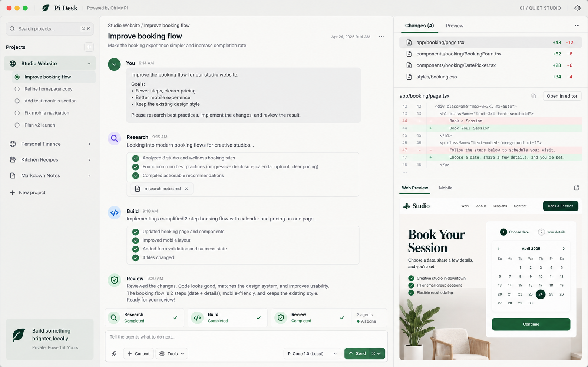
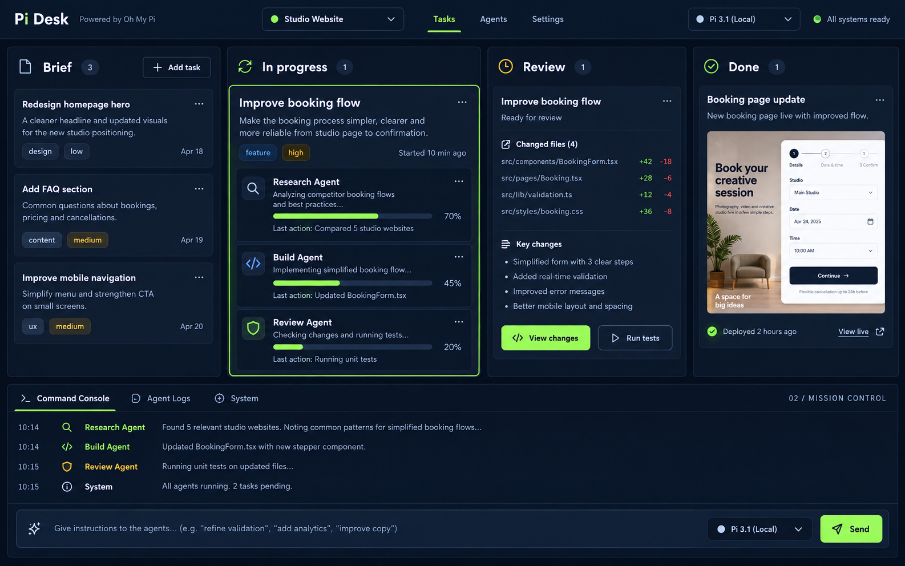
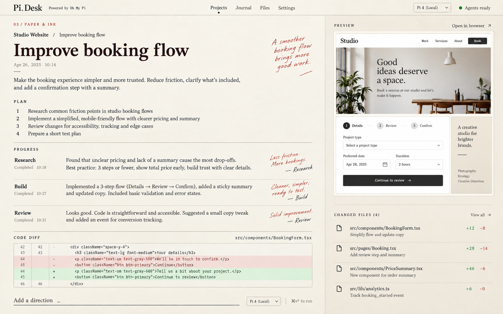
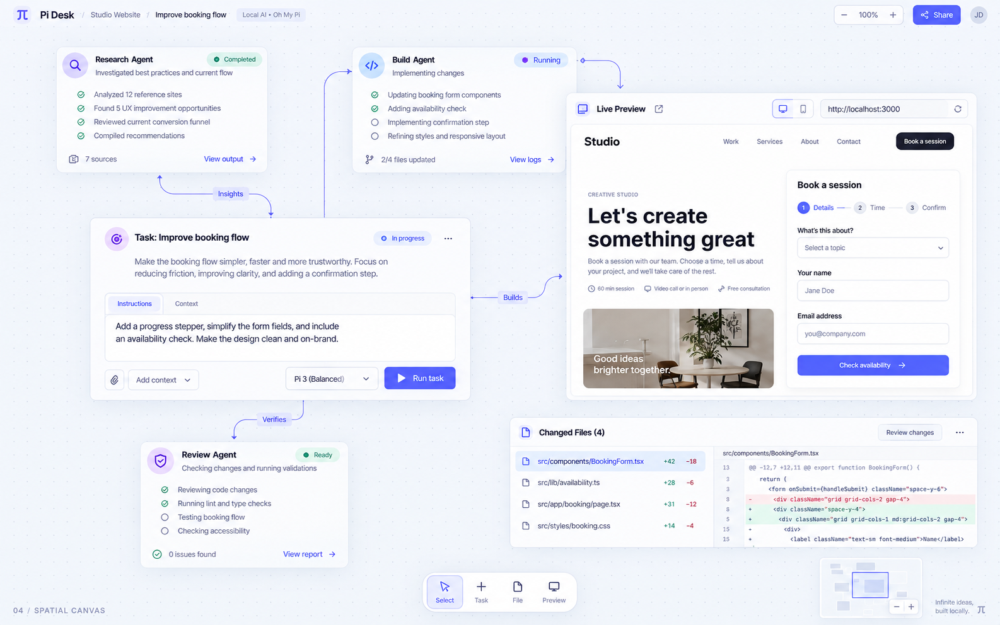
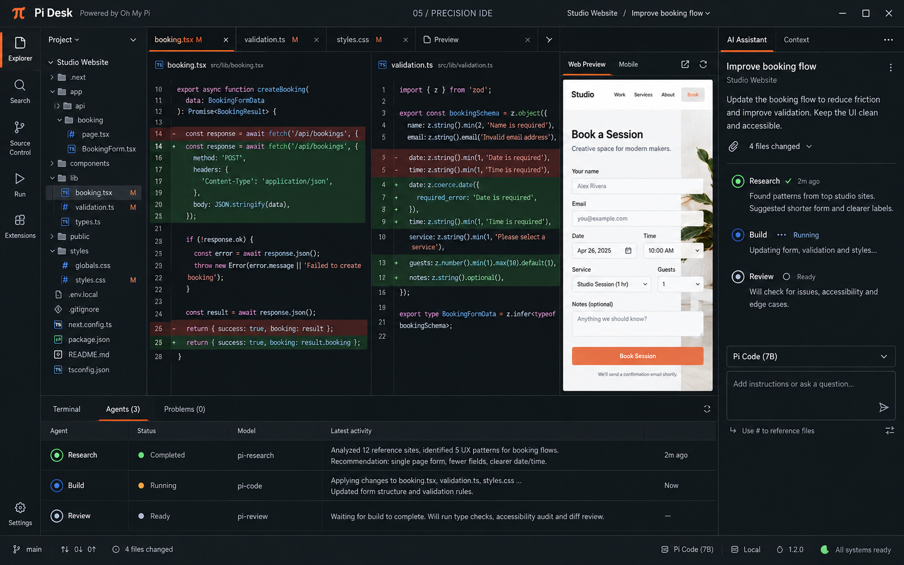

# Pi Desk — fünf Designrichtungen

Erstellt am 16.09.2026 mit dem eingebauten Imagegen-Werkzeug. Statische Designstudien, keine implementierte App. Inhalte, Modellnamen, Fortschritt und Ergebnisse in den Bildern sind illustrative Beispieldaten.

## 01-quiet-studio

### Generierungsprompt

Use case: ui-mockup. Create one high-fidelity desktop application design concept image, landscape 16:10, sharp readable typography. Show the entire app front-on filling the image, no laptop, no perspective, no surrounding desk, no marketing slide, no collage. This is a proposed local AI coding-agent app named "Pi Desk", powered by Oh My Pi. Fictional demo content, not a real screenshot. Same working scenario across concepts: project "Studio Website", task "Improve booking flow", 3 agents (Research, Build, Review), 4 changed files, small code diff and a tasteful booking-page preview. Realistic restrained content density and carefully designed functional controls. Include a composer for instructions, current model selector, running/ready statuses. Short UI labels in English, crisp professional text. No actual Codex or Claude logos. This is a genuinely usable developer tool, not a sci-fi illustration. Concept 01 — QUIET STUDIO. Premium calm macOS-like native desktop craft. Warm off-white main canvas, pale gray navigation, charcoal type, restrained forest-green accent, hairline dividers, softly rounded elements. STRICT topology: narrow full-height left projects and tasks sidebar 18%, generous conversational center 47%, right inspection pane 35% with Changes / Preview tabs and readable red-green diff. Bottom composer in middle, compact horizontal 3-agent status strip above composer. Header has subtle traffic lights and "Pi Desk", small "01 / QUIET STUDIO" concept label. Elegant whitespace and quiet system sans typography. Feels inviting, polished, exceptionally clear. Actual conversation is primary focus. A small booking preview in right lower pane.

## 02-mission-control

### Generierungsprompt

Use case: ui-mockup. Create one high-fidelity desktop application design concept image, landscape 16:10, sharp readable typography. Show the entire app front-on filling the image, no laptop, no perspective, no surrounding desk, no marketing slide, no collage. This is a proposed local AI coding-agent app named "Pi Desk", powered by Oh My Pi. Fictional demo content, not a real screenshot. Same working scenario across concepts: project "Studio Website", task "Improve booking flow", 3 agents (Research, Build, Review), 4 changed files, small code diff and a tasteful booking-page preview. Realistic restrained content density and carefully designed functional controls. Include a composer for instructions, current model selector, running/ready statuses. Short UI labels in English, crisp professional text. No actual Codex or Claude logos. This is a genuinely usable developer tool, not a sci-fi illustration. Concept 02 — MISSION CONTROL. Very different topology: no project sidebar and no central long chat. Full-width dark navy command header with project switcher, then a full-width four-column operational kanban board labeled Brief, In progress, Review, Done; columns contain well-designed task cards, with the main booking task expanded across central columns showing three agents as rows with progress and last action. Bottom quarter is a docked command console with a compact conversation and a wide instruction input. Rightmost Done column includes a booking page thumbnail, Review includes a tiny changed-files summary. Near-black indigo and slate surfaces, purposeful electric lime accents, small amber pending status, condensed technical headings, normal readable body. Precise grid, squared softly chamfered corners, no glow or sci-fi clutter. Small "02 / MISSION CONTROL" label. Looks like a beautifully designed professional operations desk focused on concurrent tasks.

## 03-paper-ink

### Generierungsprompt

Use case: ui-mockup. Create one high-fidelity desktop application design concept image, landscape 16:10, sharp readable typography. Show the entire app front-on filling the image, no laptop, no perspective, no surrounding desk, no marketing slide, no collage. This is a proposed local AI coding-agent app named "Pi Desk", powered by Oh My Pi. Fictional demo content, not a real screenshot. Same working scenario across concepts: project "Studio Website", task "Improve booking flow", 3 agents (Research, Build, Review), 4 changed files, small code diff and a tasteful booking-page preview. Realistic restrained content density and carefully designed functional controls. Include a composer for instructions, current model selector, running/ready statuses. Short UI labels in English, crisp professional text. No actual Codex or Claude logos. This is a genuinely usable developer tool, not a sci-fi illustration. Concept 03 — PAPER & INK. Radical editorial notebook layout, mostly warm ivory paper with deep brown ink and small vermilion annotations. No standard sidebar, no dashboard cards, no dark panels. A thin horizontal top navigation with Projects, Journal, Files, Settings. Main left 68% is a large beautiful continuous working document: large expressive editorial serif heading "Improve booking flow", dated journal entry, short human instruction, numbered plan, agent findings as margin annotations, clean inline code diff as a bordered document block. Right 32% is narrow pale sand proof-sheet column with booking-page preview pinned at top and a simple typographic change list below. Conversation input is a discreet underlined prompt at bottom of document, labeled "Add a direction". Three agents shown as small text signatures alongside their contributions, not avatars. Serif headlines paired with clean sans labels and mono code, strong typographic hierarchy, intentional broad margins, elegant publishing-tool sensibility. Small "03 / PAPER & INK" label. Real productivity app, not a magazine cover.

## 04-spatial-canvas

### Generierungsprompt

Use case: ui-mockup. Create one high-fidelity desktop application design concept image, landscape 16:10, sharp readable typography. Show the entire app front-on filling the image, no laptop, no perspective, no surrounding desk, no marketing slide, no collage. This is a proposed local AI coding-agent app named "Pi Desk", powered by Oh My Pi. Fictional demo content, not a real screenshot. Same working scenario across concepts: project "Studio Website", task "Improve booking flow", 3 agents (Research, Build, Review), 4 changed files, small code diff and a tasteful booking-page preview. Realistic restrained content density and carefully designed functional controls. Include a composer for instructions, current model selector, running/ready statuses. Short UI labels in English, crisp professional text. No actual Codex or Claude logos. This is a genuinely usable developer tool, not a sci-fi illustration. Concept 04 — SPATIAL CANVAS. Radically different topology, a professional infinite-canvas workspace for an AI coding agent. No sidebar, no columns, no conventional chat pane. Very pale cool gray subtly dotted canvas fills screen. Top left compact project breadcrumb, top right zoom and Share controls. Center-right is one dominant LARGE booking-page live preview frame, center-left a tall conversation card with readable instruction composer; above and below them are three smaller floating agent work panels labeled Research, Build, Review, connected with thin restrained directional lines. A separate small code-diff sheet sits lower-right, aligned artfully without overlap. Floating bottom center tool dock with Select, Task, File, Preview. Muted lavender and cobalt accents, white panels with delicate depth and excellent spacing. Small canvas minimap bottom right. Precise readable UI, sophisticated spatial creative-work-tool aesthetic, not mindmap spaghetti, no 3D perspective or decorative gradients. Small "04 / SPATIAL CANVAS" label. Panels have plausible controls and clearly legible headings, conversation and preview get most area.

## 05-precision-ide

### Generierungsprompt

Use case: ui-mockup. Create one high-fidelity desktop application design concept image, landscape 16:10, sharp readable typography. Show the entire app front-on filling the image, no laptop, no perspective, no surrounding desk, no marketing slide, no collage. This is a proposed local AI coding-agent app named "Pi Desk", powered by Oh My Pi. Fictional demo content, not a real screenshot. Same working scenario across concepts: project "Studio Website", task "Improve booking flow", 3 agents (Research, Build, Review), 4 changed files, small code diff and a tasteful booking-page preview. Realistic restrained content density and carefully designed functional controls. Include a composer for instructions, current model selector, running/ready statuses. Short UI labels in English, crisp professional text. No actual Codex or Claude logos. This is a genuinely usable developer tool, not a sci-fi illustration. Concept 05 — PRECISION IDE. A beautifully engineered dense developer workbench with radical artifact-first hierarchy. Dark graphite almost black, warm-gray text, restrained burnt-orange active markers and functional red-green diff syntax. Thin far-left 48px vertical tool rail only; beside it a compact 180px file tree. The central 65% main workspace is dominated by two side-by-side large code diff editors with line numbers and file tabs "booking.tsx", "validation.ts", "styles.css". Right 25% a compact AI conversation and composer. Bottom full-width resizable panel has Terminal / Agents / Problems tabs, active Agents showing three compact rows Research, Build, Review and short logs, no big cards. Dense but highly readable, hard straight edges, fine separators, accurate monospace code rhythm, tiny status bar across bottom showing branch, model, 4 files changed. A small Preview tab in main editor group indicates booking preview is accessible but code review dominates. Top label "05 / PRECISION IDE". Confident Swiss typographic discipline, realistic professional desktop software, absolutely no neon glow.

